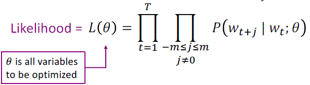

# Lecture 1: Introduction and Word Vectors

## 1. The course introduction
### 1) What do we hope to teach? (Course Objectives)
&nbsp; (1) The foundations of the effective modern methods for **deep learning applied to NLP**
* Basics first, then key methods used in NLP: Recurrent networks, attention, transformers, etc.

&nbsp; (2) **A big picture understanding of human languages** and the difficulties in understanding and producing them   

&nbsp; (3) An understanding of and **ability to build systems (in `PyTorch`)** for some of the major problems in NLP:
* Word meaning, dependency parsing, machine translation, question answering

 

## 2. Human language and word meaning
### 1) Definition of `meaning`
* `signifier` (symbol) ↔ `signified` (idea or thing)  
    = denotational semantics

### 2) `WordNet` 
* Missing nuance OR new meanings of words (incompleteness)
* Subjective
* Requires human labor
* Can’t compute accurate word similarity

### 3) Representing words as discrete symbols
* `Localist representation`
* words can be represented by `one-hot vectors`
* Vector dimension = number of words in vocabulary

### 4) Representing words by their context
* `Distributional semantics`
* A word’s meaning is given by the words that frequently appear close-by
* `Context` : the set of words that appear nearby a word in a text
* `Word vectors` : dense vector for each word, chosen so that it is similar to vectors of words that appear in similar contexts
    * also called `word embeddings` or `(neural) word representations`

 

## 3. Word2vec introduction
### 1) `Word2vec`
* `Word2vec` (Mikolov et al. 2013) : a framework for learning word vectors
* We have a large corpus
* Every word in a fixed vocabulary is represented by a `vector`
* Go through each position `t` in the text, which has a center word `c` and context words `o`
* Use the **similarity of the word vectors for `c` and `o`** to calculate the **probability of `o` given `c`** (or vice versa)
* Keep adjusting the word vectors to maximize this probability

### 2) `Word2vec` : objective function
* For each position $ 𝑡 = 1, … , 𝑇 $, predict context words within a window of fixed size $m$, given center word $w_j$

&nbsp; (1) `Likelihood` (maximize) = 
$$
\displaystyle{ L(\theta) = \prod_{t=1}^{T} \underset{j\neq0}{\prod_{-m \leq j \leq m}} P(w_{t+j}|w_t; \theta) }
$$

&nbsp; (2) `Objective Function` (minimize) = 
$$
\displaystyle{ J(\theta) = -\frac{1}{T}\log{L(\theta)} = -\frac{1}{T} \sum_{t=1}^{T} \underset{j\neq0}{\sum_{-m \leq j \leq m}} \log{P(w_{t+j}|w_t; \theta)} }
$$

&nbsp; (3) `Softmax Function` (probability) = 
$$
\displaystyle{ P(o|c) = \frac{\exp({u^T_o v_c})}{\sum_{w \in V} \exp({u^T_w v_c})} }
$$
* softmax function maps arbitrary values $x_i$ to a probability distribution $𝑝_i$

### 3) Training model
* To train a model, we gradually adjust `parameters` to minimize a `loss`
* $\theta$ represents all the model parameters, in one long vector
* $ \theta \in \mathbb{R}^{2dV} $
    * In our case, we have d-dimensional vectors and V-many words
    * In our case, every prediction requires two vectors (center vector `c` & context vector `o`)
* We optimize these `parameters` by walking down the `gradient`

 

## 4. Word2vec objective function gradients
$$
\dfrac{\partial}{\partial v_c} \log{P(o|c)} = \dfrac{\partial}{\partial v_c} \log{ \frac{\exp({u^T_o v_c})}{\sum_{w \in V} \exp({u^T_w v_c})} }
$$
$$
= ... = u_o - \sum_{x=1}^{V}P(x|c)u_x = observed - expected
$$

 

---

 

## Key learning today
* `word meaning` can be represented rather well by a large vector of real numbers
