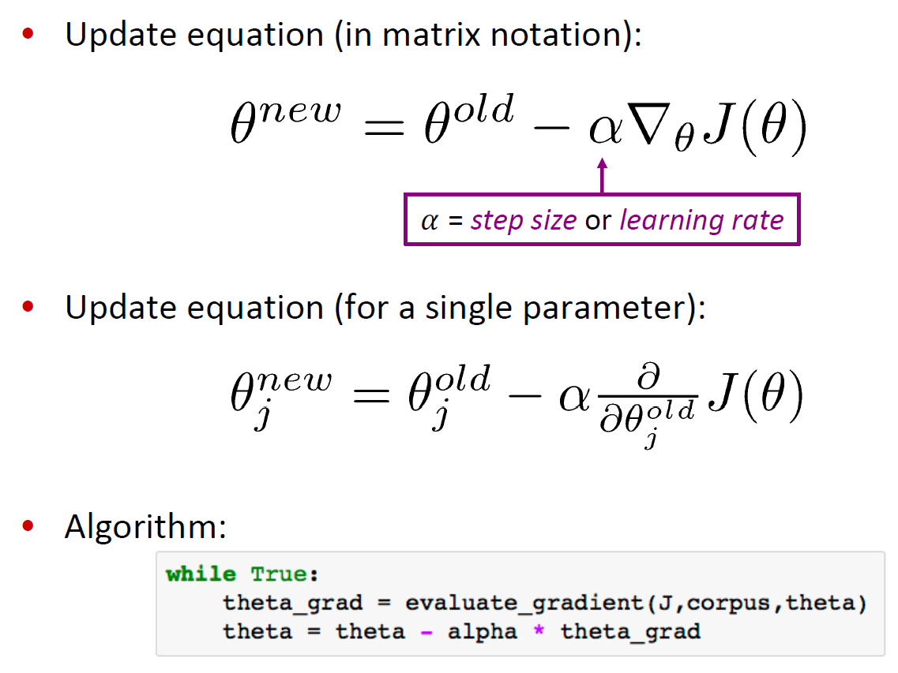
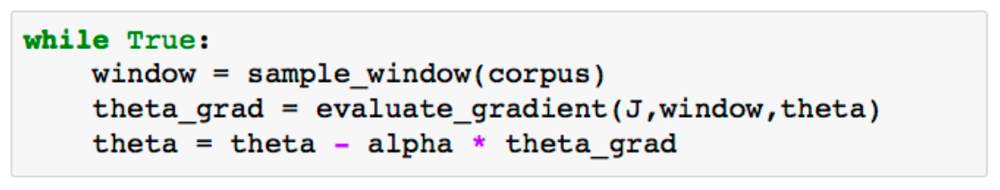
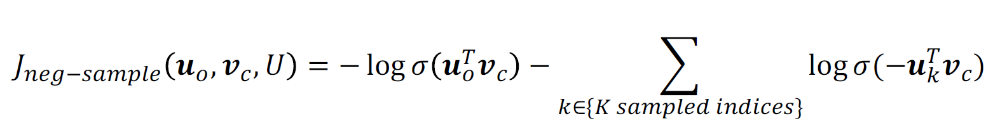

# Lecture 2: Word Vectors, Word Senses, and Neural Network Classifiers

## 1. Review: Main idea of word2vec
* Initialize random vectors for each word → Predict surrounding words using center word, or vice versa
* Learning is done by Updating vectors so they can predict actual surrounding/center words better
     
* `Word2vec` is "`Bag of words`" model - same prediction at each position (ignoring word positions in sentences)
* `Word2vec` maximizes objective function by putting similar words nearby in space

 

## 2. Optimization: Gradient Descent
### 1) Gradient Descent
* `Gradient Descent` : learning method for Word2vec - algorithm to minimize objective function $J(\theta)$ by changing $\theta$
    #### (1) Initialize random vectors for each word
    #### (2) Calculate gradient of $J(\theta)$
    #### (3) Take small step in the direction of negative gradient
    #### (4) Repeat (1)~(3)
      

### 2) Stochastic Gradient Descent
* **Problem** - Original $\nabla_{\theta}J(\theta)$ is very 
expensive to compute
    * $J(\theta)$ is a function of all windows in the corpus 
* **Solution** - `Stochastic Gradient Descent` : Repeatedly sample windows, and update after each one, or each small batch
  

 

## Word2vec algorithm family: More details

### 1) Two model variants of `Word2vec`
* `Skip-grams (SG)` : Predict context (“outside”) words (position independent) given center word
* `Continuous Bag of Words (CBOW)` : Predict center word from (bag of) context words

### 2) Negative sampling
* `Negative sampling` : training `binary logistic regressions` for a `true pair` (center word & context word) versus several `noise pairs` (center word & random words)
    

    #### (1) Take k `negative samples` (using word probabilities)
    * Sample with $ P(w)=U(w)^{3/4} ÷ Z $, the unigram distribution $U(w)$ raised to the 3/4 power
    #### (2) Maximize probability that real outside word appears, minimize probability that random words appear around center word

 

## 3. Why not capture co-occurrence counts directly?

 

## 4. Towards GloVe: Count based vs. direct prediction

 

## 5. How to evaluate word vectors?

 

## 6. Word senses and word sense ambiguity

 

## 7. Classification review and notation

 

## 8. Neural Network Classifiers

