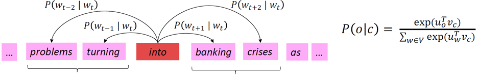

# Lecture 2: Word Vectors, Word Senses, and Neural Network Classifiers

## 1. Review: Main idea of word2vec
* Initialize random vectors for each word → Predict surrounding words using center word, or vice versa
* Learning is done by Updating vectors so they can predict actual surrounding/center words better
     
* Word2vec is "Bag of words" model - same prediction at each position (ignoring word positions in sentences)
* Word2vec maximizes objective function by putting similar words nearby in space

 

## 2. Optimization: Gradient Descent
### 1) 
* 

 

## 3. Why not capture co-occurrence counts directly?

 

## 4. Towards GloVe: Count based vs. direct prediction

 

## 5. How to evaluate word vectors?

 

## 6. Word senses and word sense ambiguity

 

## 7. Classification review and notation

 

## 8. Neural Network Classifiers

