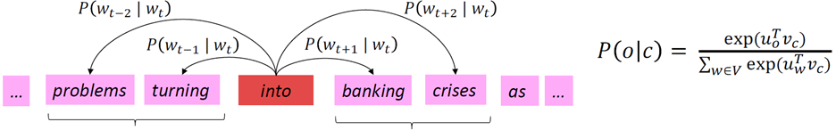
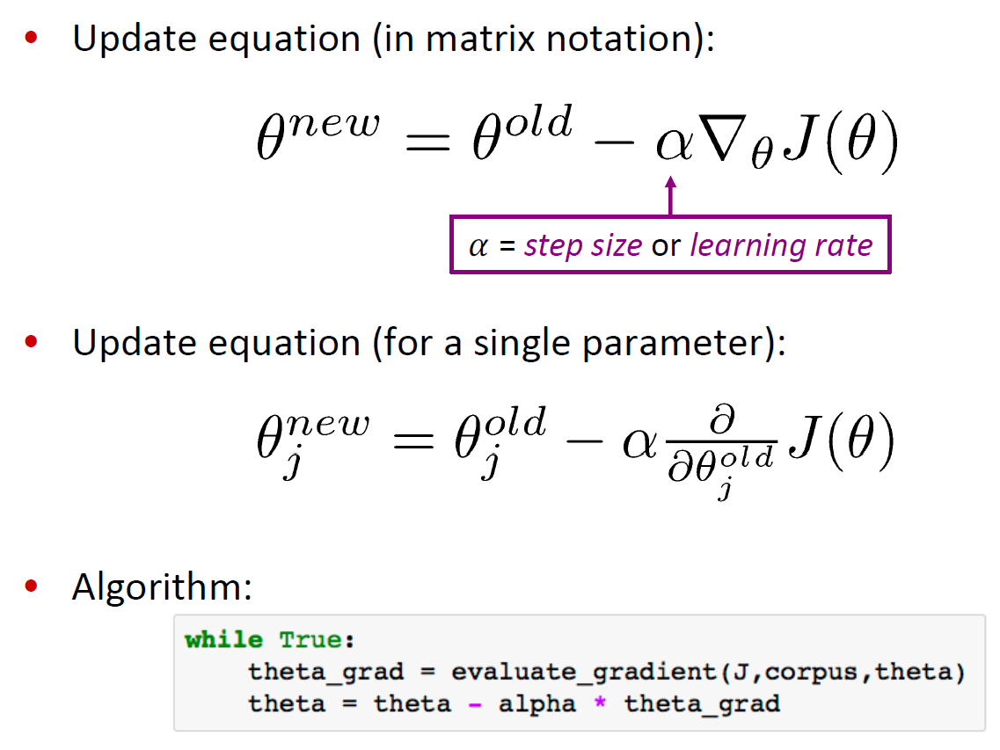
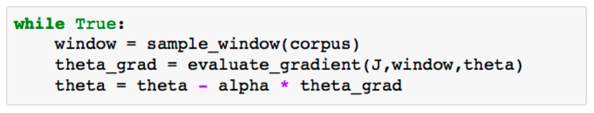
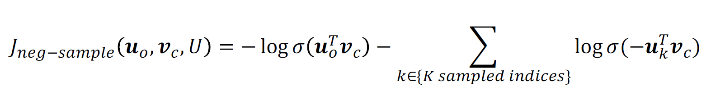
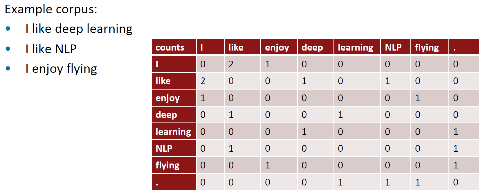
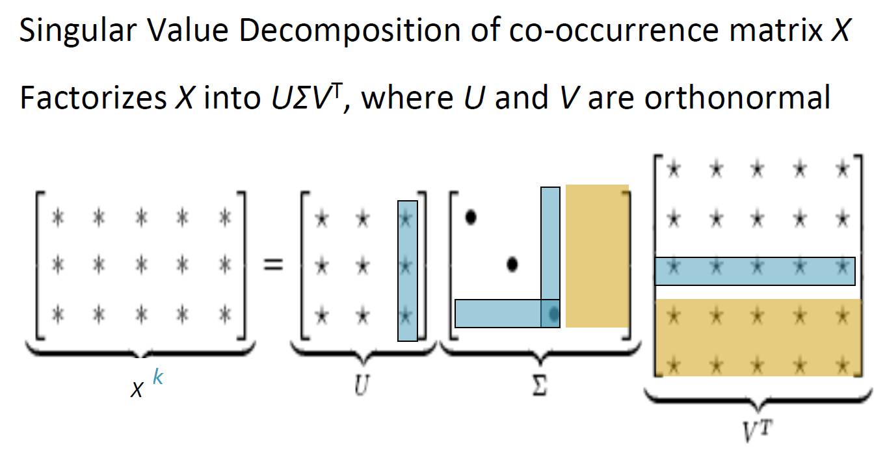
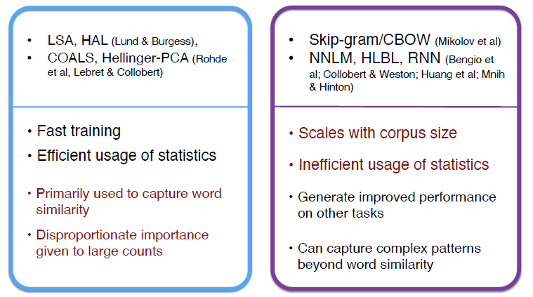
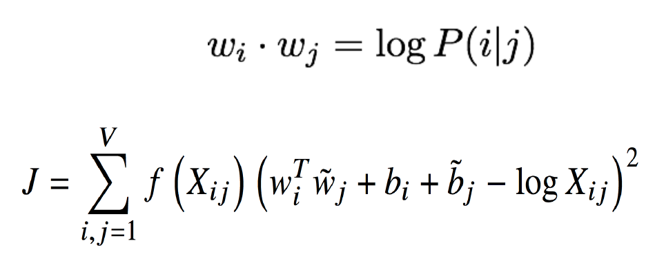
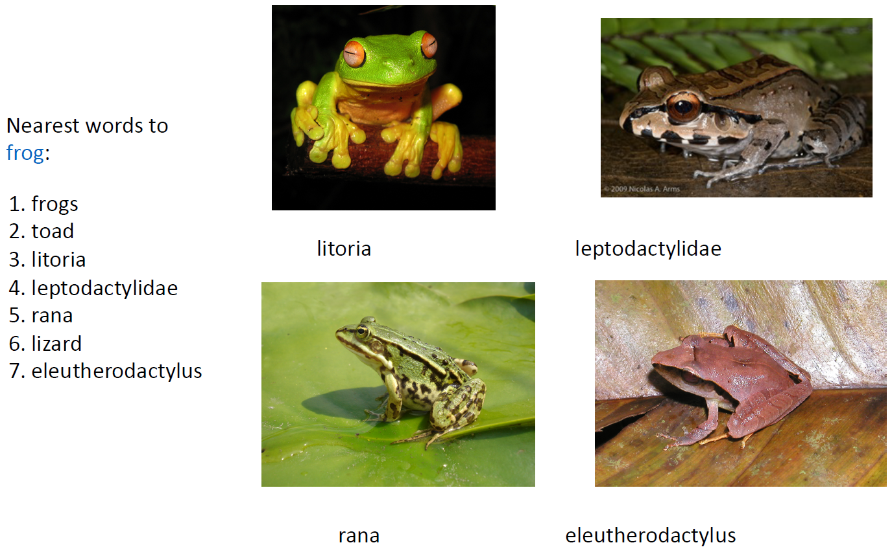
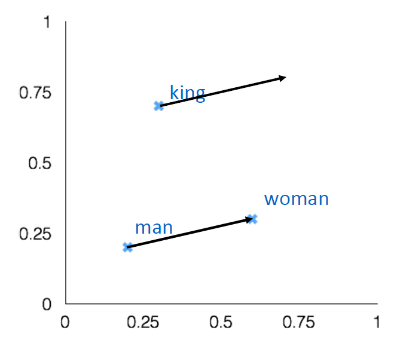

# Lecture 2: Word Vectors, Word Senses, and Neural Network Classifiers

## 1. Review: Main idea of word2vec
* Initialize random vectors for each word → Predict surrounding words using center word, or vice versa
* Learning is done by Updating vectors so they can predict actual surrounding/center words better

    

* `Word2vec` is "`Bag of words`" model - same prediction at each position (ignoring word positions in sentences)
* `Word2vec` maximizes objective function by putting similar words nearby in space

 

## 2. Optimization: Gradient Descent
### 1) Gradient Descent
* `Gradient Descent` : learning method for Word2vec - algorithm to minimize objective function $J(\theta)$ by changing $\theta$
    #### (1) Initialize random vectors for each word
    #### (2) Calculate gradient of $J(\theta)$
    #### (3) Take small step in the direction of negative gradient
    #### (4) Repeat (1)~(3)

    

### 2) Stochastic Gradient Descent
* **Problem** - Original $\nabla_{\theta}J(\theta)$ is very 
expensive to compute
    * $J(\theta)$ is a function of all windows in the corpus 
* **Solution** - `Stochastic Gradient Descent` : Repeatedly sample windows, and update after each one, or each small batch

    

 

## Word2vec algorithm family: More details

### 1) Two model variants of `Word2vec`
* `Skip-grams (SG)` : Predict context (“outside”) words (position independent) given center word
* `Continuous Bag of Words (CBOW)` : Predict center word from (bag of) context words

### 2) Negative sampling
* `Negative sampling` : training `binary logistic regressions` for a `true pair` (center word & context word) versus several `noise pairs` (center word & random words)

    

    #### (1) Take k `negative samples` (using word probabilities)
    * Sample with $ P(w)=U(w)^{3/4} ÷ Z $, the unigram distribution $U(w)$ raised to the 3/4 power
    #### (2) Maximize probability that real outside word appears, minimize probability that random words appear around center word

 

## 3. Why not capture co-occurrence counts directly?
### 1) Basic concept of `co-occurrence matrix`
* Another method to get word vectors
* the matrix of counts of **how frequently words occur with each other**
* representation of words as co-occurrence vectors
* 2 options of `co-occurrence matrix` : **Windows VS Full Document**
    * `Windows` - captures some syntactic and semantic
information (locality & proximity)
    * `Full Document` (ex. paragraphs, pages, documents) - Word-document co-occurrence matrix will give general topics leading to `Latent Semantic Analysis`

        

### 2) Problems & Solutions
* **Problem with `co-occurrence matrix`** : Very high dimension & require lots of storage & Very high sparsity
    * Vectors increase in size with vocabulary
    * Subsequent classification models have sparsity issues → Models are less robust
* **Solution** : `Dimensionality Reduction` (Low-dimensional vectors)
    * Store most of the important information in a fixed, small number of dimensions (a `dense vector`)
    * Usually 25–1000 dimensions, similar to `word2vec`
    * `Singular Value Decomposition` : Decompose a matrix $X$ into three matrices $U, \Sigma, V^T$
    * We can get lower dimensional matrix than original `co-occurrence matrix` by rataining only *k* singular values 

        

* **Problem with `SVD`** : Running on raw counts doesn’t work well
    * Mathmatical assumption of `SVD` : normally distributed errors
    * However, `function words` (ex. the, he, has) are too frequent in `co-occurrence matrix`
* **Solution** : **Scaling the counts** in the cells can help a lot
    * **Log** the frequencies
    * **Cap** the frequencies : $ min(X,t) $ , with $ t ≈ 100 $ 
    * **Ignore & Remove** the `function words`
* Example case of scaled vectors : `COALS` model (Rohde et al. ms., 2005)

 

## 4. Towards GloVe: Count based vs. direct prediction
### 1) Basic concept of `GloVe`
* **Starting point** : trying to connect 2 methods together
    * linear algebra based methods on `co-occurrence matrices` (ex. `LSA`, `COALS`) 
    * iterative neural updating algorithms (ex. `Skip-gram`, `CBOW`)

     

### 2) Encoding meaning in vector differences
* Crucial insight : Ratios of `co-occurrence probabilities` can encode meaning components
* We can use `log-bilinear model` with vector differences to capture ratios of `co-occurrence probabilities` as
linear meaning components in word vector space

    

### 3) results of `GloVe`
* `GloVe` showed notable results in encoding word meaning in vector space

    

* To insist that `GloVe` works well, it's important to suggest clear measures/methods for evaluation

 

## 5. How to evaluate word vectors?
* `Intrinsic`(intermediate subtask) VS `Extrinsic` (real task)
### 1) `Instrinsic` word vector evaluation
* Evaluation on a specific/intermediate subtask
* **Strong Point** : Fast & Helps to understand that system
* **Weak Point** : Not clear if it's really helpful unless correlation to real task is established
* *Ex1.* `Word Vector Analogies` : Evaluate word vectors by how well their `cosine distance` captures `analogy questions` (semantic and syntactic)

    

* *Ex2.* Evaluations with `similarity label` : Compare word vector distances and their `correlation` with `human judgments`

### 2) `Extrinsic` word vector evaluation
* Evaluation on a real task
* **Strong Point** : Clear if it's really helpful for real task
* **Weak Point** : Takes long time & Unclear which is the problem (the subsystem OR its interaction OR other subsystems)
* *Ex1*. `Named Entity Recognition` : identifying references to a person, organization or location

 

## 6. Word senses and word sense ambiguity
* Most words have lots of `meanings(senses)` (ex. `pike`)
* There have been researches to have different `word vectors` for different `meanings(senses)` of a word
* In practice, those methods are not used commonly since it is very unclear how to cut word into different `senses` (most of them could actually be overlapped)
