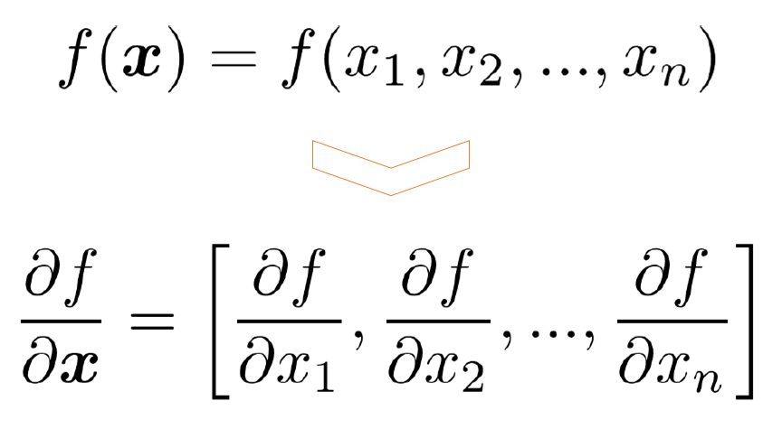
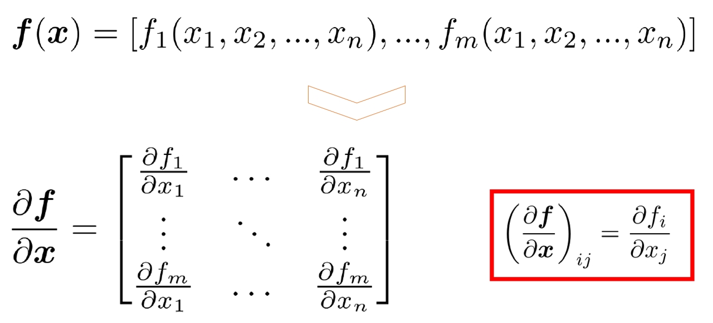
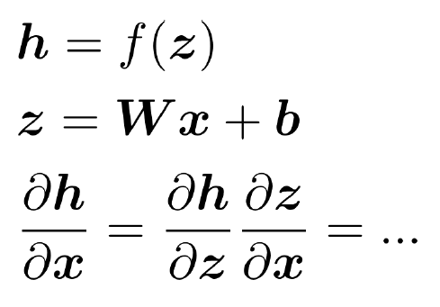
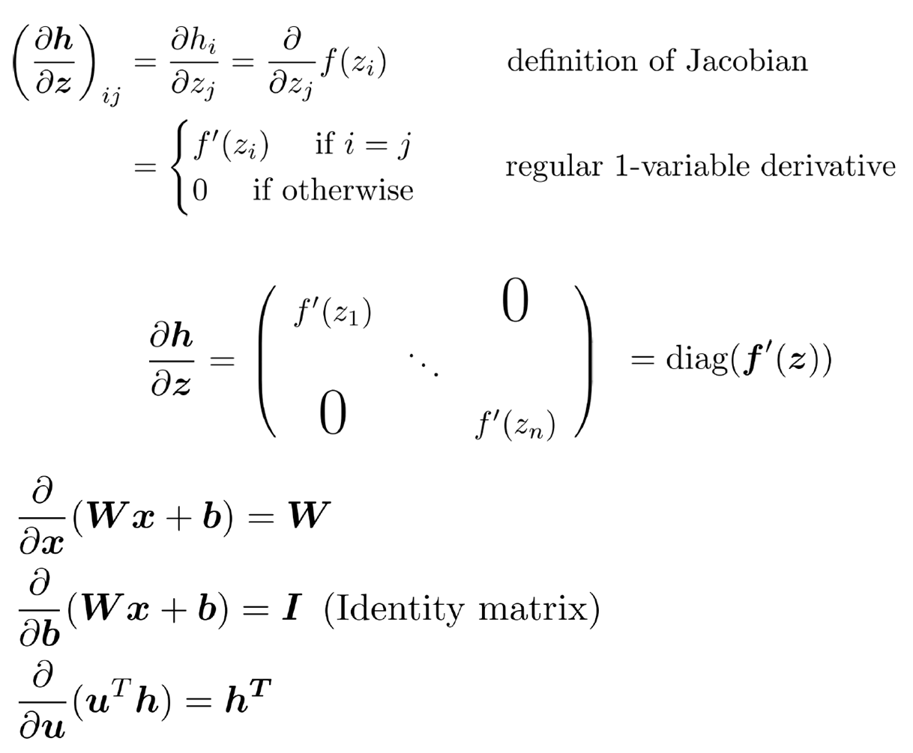
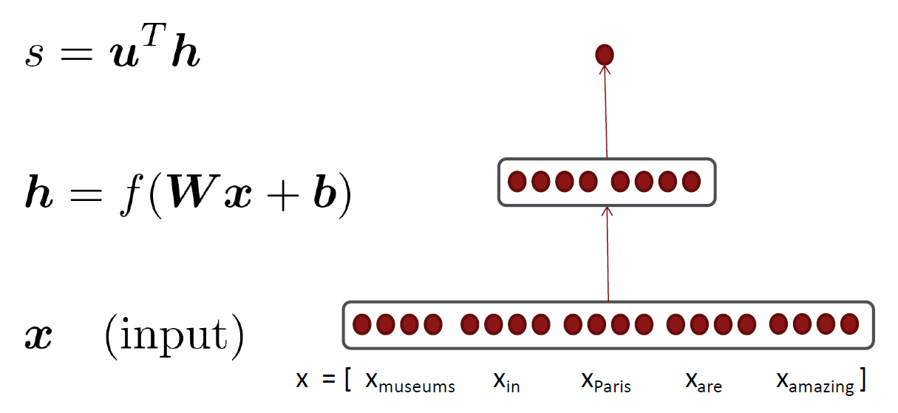
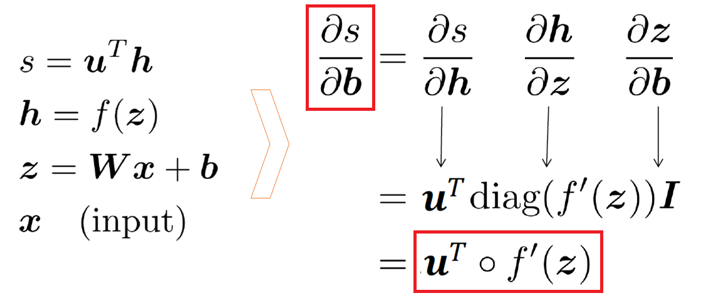
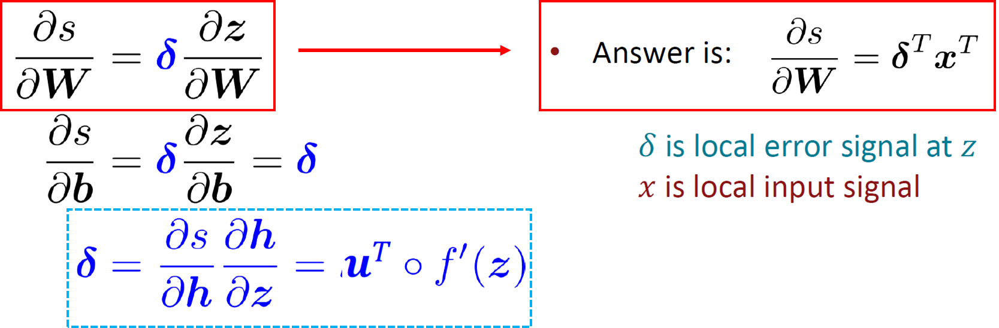

# Lecture 3: Neural net learning: Gradients by hand and algorithmically

## 1. Introduction : `Named Entity Recognition` (NER)
*  **The task** : find and classify `names` in text

    

* **Simple solution** : Window classification using `binary logistic classifier`
    * classify center word based on a concatenation of word vectors in a context window of neighboring words

    

* With predicted model probability of class, we can Calculate `gradients` for each parameter & and Update the `parameters` to train the model

 

## 2. Matrix calculus
### 1) `Jacobian Matrix` : Generalization of the `Gradient`
* `Gradients` : "How much will the output change if we change the input a bit?"
* Given a function with 1 output and 1 input, its gradient (slope) is its `derivative` (1×1)
* Given a function with 1 output and n inputs, its gradient is a `vector of partial derivatives` with respect to each input (1×n)

    

* Given a function with m outputs and n inputs, its `Jacobian`(gradient) is an m x n `matrix of partial derivatives` (m×n)

    

### 2) `Chain Rule`
* For composition of one-variable functions, multiply `derivatives`

    

* For multiple variables at once, multiply `Jacobians`

    

### 3) Example `Jacobians`
* Example calculation cases of `Jacobian`

    

### 4) Back to the `Neural Net`
* Let's find the partial derivatives of the `score` $s$ (real number) with respect to the different parameters of `Neural Net`

    

* the partial derivatives of $s$ with respect to $b$

    

* the partial derivatives of $s$ with respect to $W$
    * We can re-use $\delta$ (duplicated computation from previous layer)

    

 