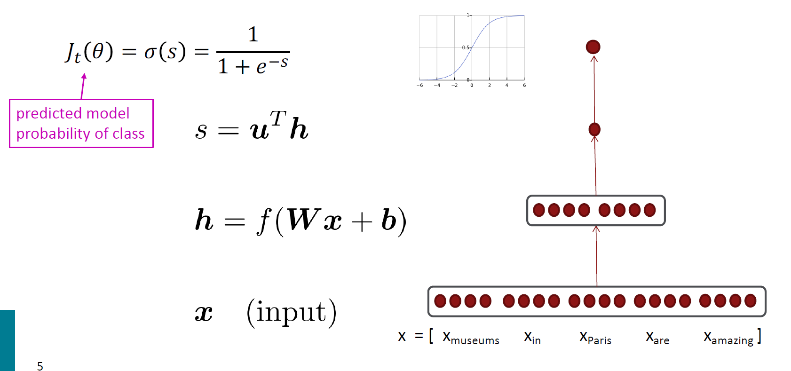

# Lecture 3: Neural net learning: Gradients by hand and algorithmically

## 1. Introduction : Named Entity Recognition (NER)
*  **The task** : find and classify `names` in text

    

* **Simple solution** : Window classification using `binary logistic classifier`
    * classify center word based on a concatenation of word vectors in a context window of neighboring words

    

* With predicted model probability of class, we can Calculate `gradients` for each parameter & and Update the `parameters` to train the model

 