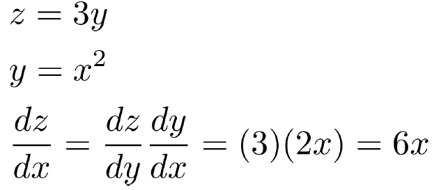

# Lecture 3: Neural net learning: Gradients by hand and algorithmically

## 1. Introduction : `Named Entity Recognition` (NER)
*  **The task** : find and classify `names` in text

    

* **Simple solution** : Window classification using `binary logistic classifier`
    * classify center word based on a concatenation of word vectors in a context window of neighboring words

    

* With predicted model probability of class, we can Calculate `gradients` for each parameter & and Update the `parameters` to train the model

 

## 2. Matrix calculus
### 1) `Jacobian Matrix` : Generalization of the `Gradient`
* `Gradients` : "How much will the output change if we change the input a bit?"
* Given a function with 1 output and 1 input, its gradient (slope) is its `derivative` (1×1)
* Given a function with 1 output and n inputs, its gradient is a `vector of partial derivatives` with respect to each input (1×n)

    

* Given a function with m outputs and n inputs, its `Jacobian`(gradient) is an m x n `matrix of partial derivatives` (m×n)

    

### 2) `Chain Rule`
* For composition of one-variable functions, multiply `derivatives`

    

* For multiple variables at once, multiply `Jacobians`

    

### 3) Example `Jacobians`
* Example calculation cases of `Jacobian`

    

### 4) Back to the `Neural Net`
* Let's find the partial derivatives of the `score` $s$ (real number) with respect to the different parameters of `Neural Net`

    

* the partial derivatives of $s$ with respect to $b$

    

* the partial derivatives of $s$ with respect to $W$
    * We can re-use $\delta$ (duplicated computation from previous layer)

    

 

## 3. `Backpropagation`
### 1) `Computation Graphs` and `Backpropagation`
* `Backpropagation` : taking & propagating derivatives using the matrix `chain rule`
    * We efficiently **re-use derivatives** computed for higher layers in computing derivatives for lower layers to minimize computation
* To do `backpropagation` in computational systems, software constructs `computation graphs`
* The `neural net` equations are represented as a graph
    * Source nodes: inputs
    * Interior nodes: operations
    * Edges pass along results of the operations

    

### 2) `Backpropagation`: Single Node
* Edges pass along results of the gradients

    

* Each node receives an `upstream gradient` & pass on the correct `downstream gradient`
* Each node has a `local gradient` (The gradient of its output with respect to its input)
* [`downstream gradient`] = [`upstream gradient`] × [`local gradient`]

    

* Nodes with **multiple inputs** → multiple `local gradients` & multiple `downstream gradients` with respect to each input

    

* Nodes with **multiple outputs** → gradients sum at outward branches

    

### 3) Node Intuitions
* `addition` “**distributes**” the upstream gradient
* `max function` “**routes**” the upstream gradient (the upstream gradient goes to only one of the branches below it)
* `multiplication` “**switches/flips**” the upstream gradient

### 4) Automatic Differentiation
* The gradient computation can be automatically inferred from the symbolic expression of the forward propagation (ex. `Theano`)
    * However, Automatic Differentiation requires symbolic manipulation which is too hard to follow
* Modern DL frameworks (ex. `Tensorflow`, `PyTorch`) do backpropagation for you but mainly leave layer/node writer to hand-calculate the local derivative

    

### 5) Manual Gradient checking: Numeric Gradient
* Sometimes, we want to (or need to) check if we're computing the right gradients
* Standard way of checking gradients - manually work out the gradient (numeric calculation of gradient)

    

* Modern deep learning frameworks compute gradients automatically, but backpropagation doesn’t always work perfectly
* Therefore, understanding what is going on under the hood is crucial for debugging and improving models

 

---

 

## Key learning today
* All the math details of doing `neural net learning`
    * how we can work out (by hand) `gradients` for training neural networks
    * how gradient calculation is done more algorithmically - `back propagation` algorithm
* `Backpropagation`: recursively (and hence efficiently) apply the `chain rule` along `computation graph`
    * [`downstream gradient`] = [`upstream gradient`] × [`local gradient`]
* `Forward pass`: compute results of operations and save intermediate values
* `Backward pass`: apply chain rule to compute gradients
