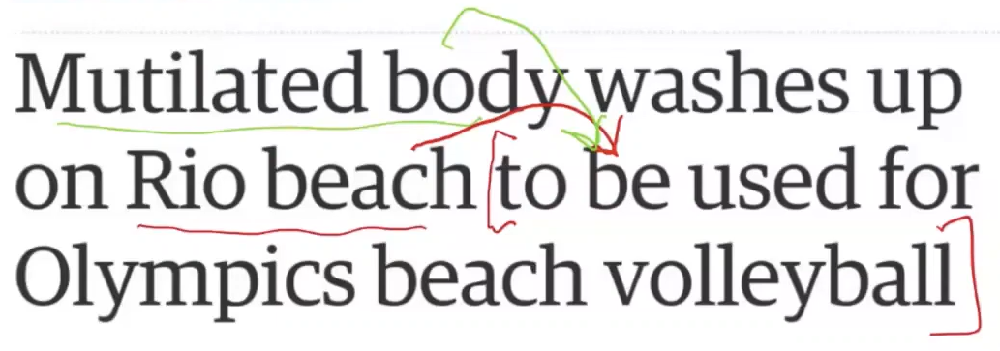

# Lecture 4: Dependency Parsing

## 1. Two views of linguistic structure
### 1) `Context-Free Grammars (CFGs)`
* `Context-Free Grammars (CFGs)` = Constituency = phrase structure grammar
* `phrase` structure organizes `words` into nested `constituents`
* `words` (starting unit) → words combine into `phrases` → phrases can combine into bigger `phrases`

    
    

### 2) `Dependency structure`
* `Dependency structure` shows which `words` depend on (modify, attach to, or are arguments of) which other `words`
* In modern NLP (starting around 2000), `Dependency Grammar` is most common (ex. `dependency parser`)

    

### 3) Why do we need `sentence structure`?
* Humans communicate complex ideas by composing words together into bigger units to convey complex meanings
* Listeners need to work out what modifies(attaches to) what
* A `model` needs to understand `sentence structure` in order to be able to interpret language correctly

 

## 2. `ambiguities` in natural language
* Examples of different `ambiguities` in natural language show how `sentence structure` is interesting and difficult
* Different languages have different syntactic constructions, different word orders, different amount of words, different forms of words(ex. case markings) → Depending on those details, there might be different kinds of `ambiguities`

### 1) Prepositional Phrase attachment ambiguity
* one of the commonest ambiguities in English → Many English sentences have `prepositional phrases` all over the place 
* We get an exponential number of parses in terms of the number of `prepositional phrases`

    
    

### 2) Coordination scope ambiguity 

### 3) Adjectival/Adverbial Modifier Ambiguity
* When we have modifiers that are `adjectives` and `adverbs`, there are different ways that we can have things modifying other things

    

### 4) Verb Phrase (VP) attachment ambiguity

 